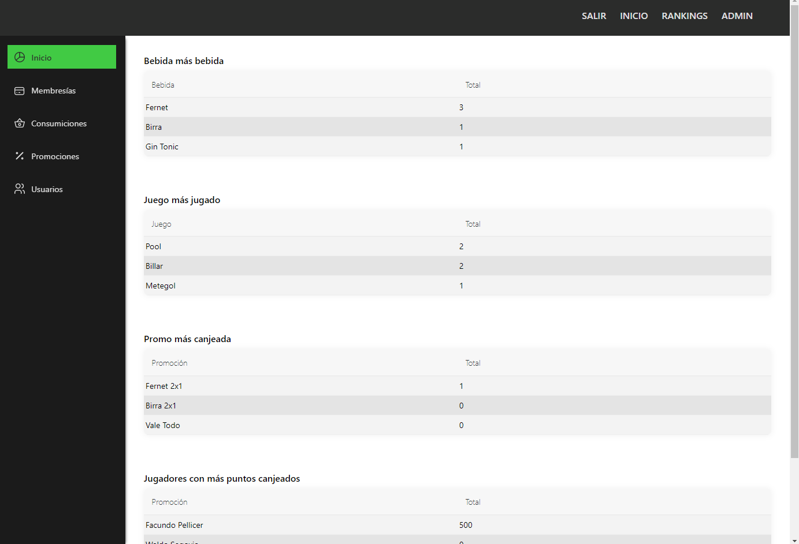
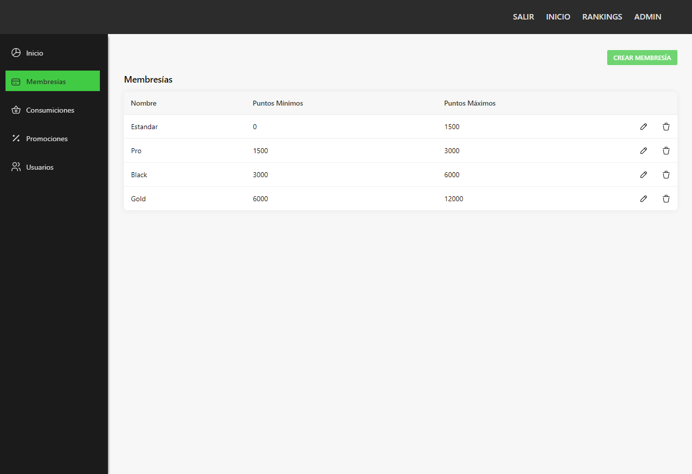
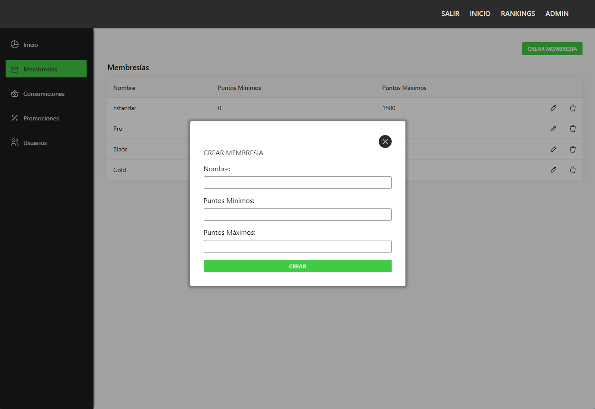
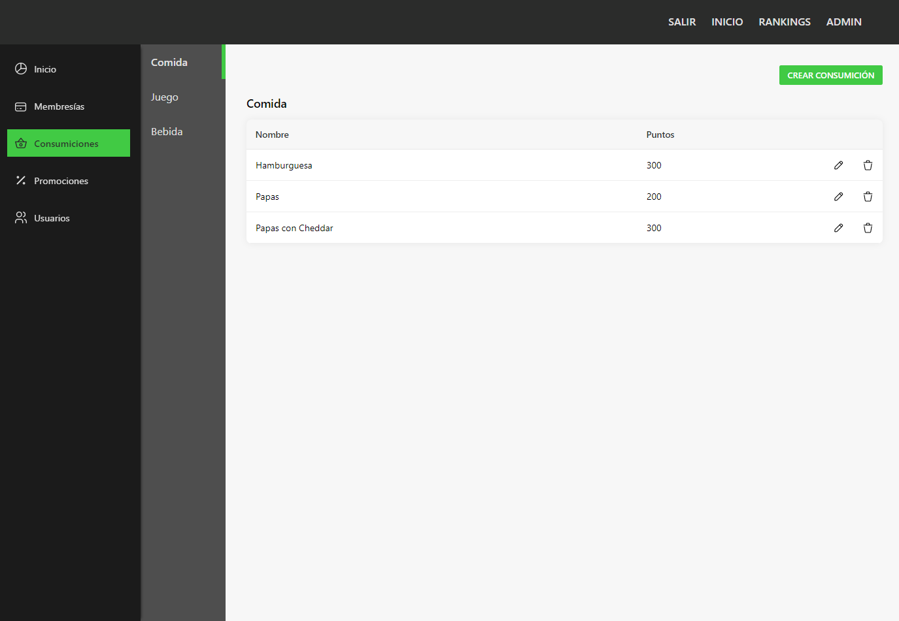
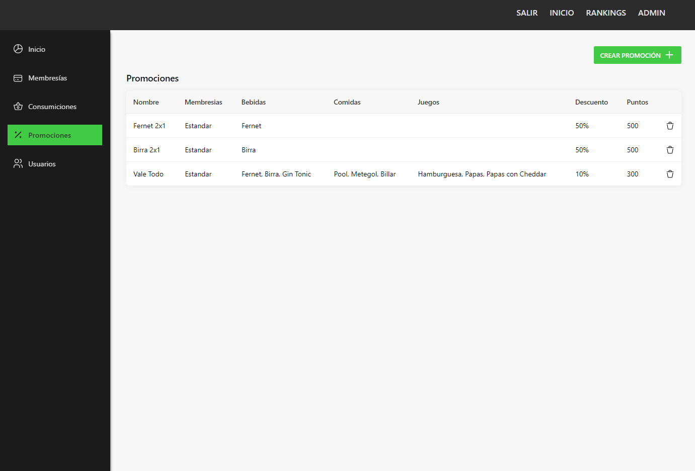
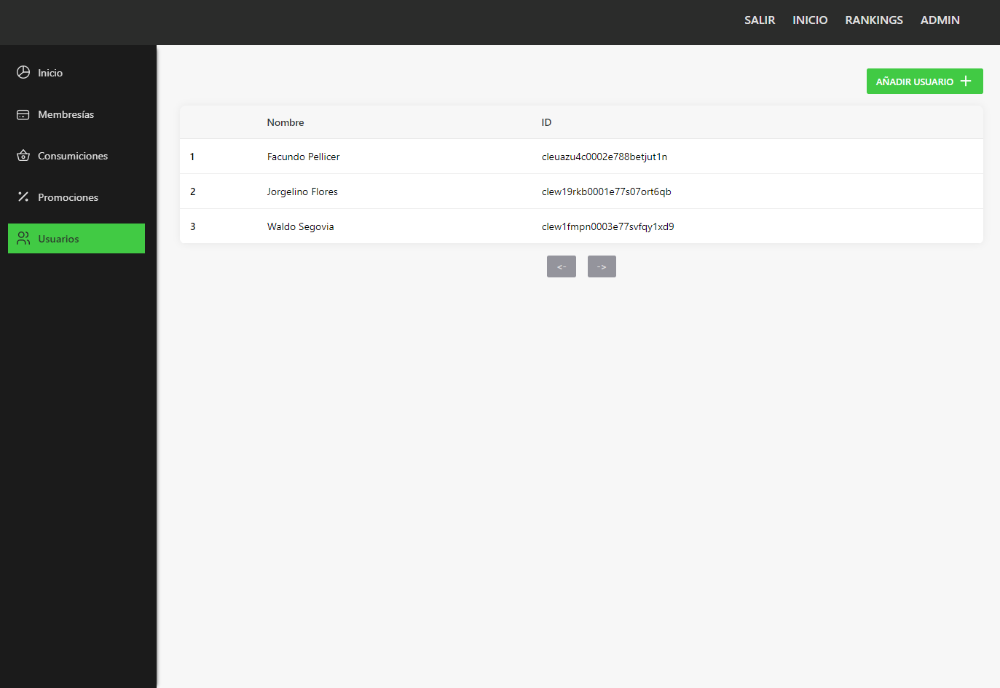
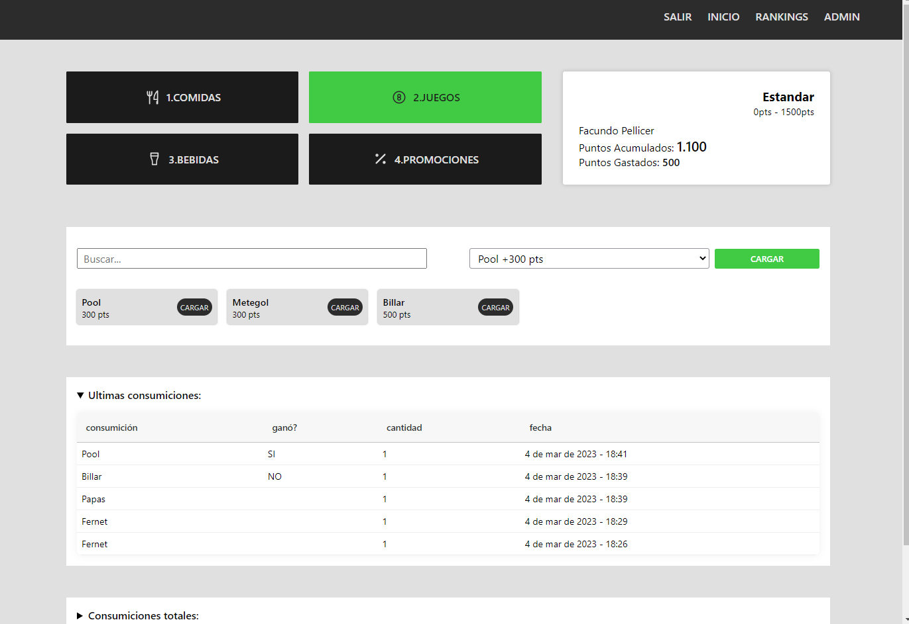

# BAR DE JUEGOS APP

Web para gestionar un bar con un sistema de membresías. Los clientes con cada consumición van ganando puntos que luego pueden cambiar por promociones dependidendo la membresía que tenga.

## Tech Stack

**Client:** Next.js, Typescript, Sass, Socket.io

**Back:** Nextjs, Typescript, Prisma, PostgreSQL, Socket.io

Socket.io esta siendo utilizado para una página donde se muestra el ranking de jugadores en tiempo real.

## Screenshots

